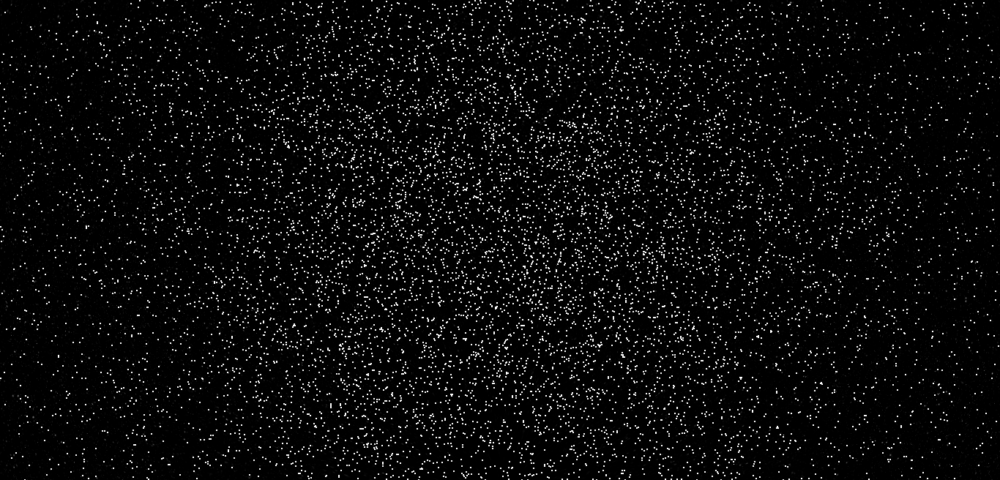

# Projects

## [react-uncontrolled-forms](https://marcbperez.github.io/react-uncontrolled-forms/)

Uncontrolled React forms inside a Redux boilerplate. With SASS, Gradle and
Docker images for development and production.

## [webgl-earth](https://marcbperez.github.io/webgl-earth/)

An earth in space made with Three.js and WebGL. The planet floats in a
starfield, surrounded by clouds, and rotates at a constant speed.

## [mdl-estore](https://marcbperez.github.io/mdl-estore/home.html)

Generic eStore template made with Material Design Lite and AngularJS. Includes
responsive pages for the cart, products and categories.

## [webgl-particles](https://marcbperez.github.io/webgl-particles/)

Particles in space made with Three.js and WebGL. Designed to test the maximum
number of points in a condensed space.

---

[][linkedin]
[][github-repository]
[][docker-hub]
[][npm]
[][pypi]
[][launchpad]
[][tindie]

[docker-hub]: https://hub.docker.com/u/marcbperez/
[github-repository]: https://github.com/marcbperez
[launchpad]: https://launchpad.net/~marcbperez/
[linkedin]: https://linkedin.com/in/marcbperez/
[npm]: https://npmjs.com/~marcbperez/
[pypi]: https://pypi.org/user/marcbperez/
[tindie]: https://tindie.com/stores/marcbperez/
